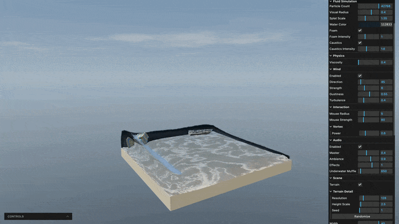

<p align="center">
  
</p>

<p align="center">
  <i>A real time fluid simulation on the web, running entirely on the GPU.</i>
</p>

<p align="center">
  
  <br>
  <a href="https://fluid-simulation-sigma.vercel.app">Live demo</a>
</p>

## About

A real time fluid simulation built using Three.js and WebGPU. The entire
pipeline including the particle solver, rendering and postprocessing all runs on the GPU, so it stays
performant with tens of thousands of particles.

I built this project to mess around with WebGPU compute shaders and screen space fluid
rendering. It's pretty much not meant to be physically accurate, instead I wanted something
that looks awesome and runs relatively fast.

## Features

- GPU based fluid solver
- Screen space fluid rendering
- Foam, caustics, and light absorption
- Rigid bodies that float, sink, and get tossed around
- Sculptable procedural terrain
- Wind and interactive forces
- Adaptive audio that reacts to the fluid

## Controls

| Key            | Action         |
| -------------- | -------------- |
| `LMB`          | Orbit camera   |
| `Scroll`       | Zoom in / out  |
| `RMB`          | Grab fluid     |
| `MMB`          | Push fluid     |
| `Shift`+ `LMB` | to grab        |
| `Ctrl` + `LMB` | to push        |
| `V` + `LMB`    | vortex         |
| `B` + `LMB`    | sculpt         |
| `Space`        | Pause / Resume |
| `.`            | Step once      |
| `R`            | Reset fluid    |

## Technology

- TypeScript
- Three.js
- WebGPU
- Vite
- lil-gui
- three-mesh-bvh

## Running Locally

Clone the repository and install the dependencies:

```bash
npm install
```

Start the development server:

```bash
npm run dev
```

Then open the local URL provided by Vite.

## License

FluidSim is open source software licensed under the MIT License.

See [LICENSE](LICENSE) for the full license text.
